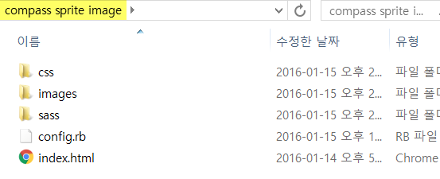

# Compass Sprite Image 만들기

### sprite image는 어떻게 만들어져 왔지?  
- 포토샵  
- N-MET  

위에서 하는 작업들은 단순하게 여러개의 image를 하나의 image로 합쳐주는 일을 합니다.  

### 단점은?  
- 시간이 오래걸림
- 유지보수가 힘듬
- css를 따로 작성

### compass sprite image를 사용하면?  
- sprite image를 자동으로 생성
- css 코드를 자동으로 생성
- 유지보수가 쉬움

만들어진 후 사용하고자 하는 장소에 class="이미지명" 만 입력하면 됩니다.

<br />

### 어떻게 쓰는건데?

#### ruby 설치
sass와 compass는 ruby 기반으로 돌아가기 때문에 ruby를 설치해야 합니다.  
os x는 기본적으로 ruby가 설치되어있고, windows 사용자만 설치해주세요.  

[ruby install 다운로드 바로가기](http://rubyinstaller.org/downloads/)


#### sass 설치
이제 command 창에서 gem을 통해 sass와 compass를 설치 할 수 있습니다.
```bash
gem install sass
```

#### compass 설치
```bash
gem install compass
```

#### 파일 다운로드
compass sprite image 폴더 다운로드  



config.rb 파일이 있는 위치에서 command창을 열고  
```bash
compass watch
```
설정된 폴더 안에 파일들을 감지하여 변환시키는 일을 합니다.  

<br />

#### compass watch가 하는 일
1. sass폴더 안에 있는 .sass파일을 css폴더안에 있는 .css 파일로 변환
2. images/sp, images/icon 폴더 안에 있는 이미지를 images/sprites/ 경로에 sprite image로 뱉어냄
3. sp, icon 폴더 안에 있는 모든 이미지의 width, height, background 정보를 .css로 뱉어냄

그 외에도 html, css, js의 압축등을 합니다. 
<br />

#### config.rb 설정
config.rb(.루비) 파일은 compass를 동작하기 위한 설정파일 입니다.

- 폴더의 경로를 지정
- css 변환 스타일을 설정
- 변경될 파일 이름 설정
- sprite image의 image간 간격등 설정 등등 

사용자의 입맛대로 설정이 가능합니다.

<br />

#### sprite image를 여러개 만들고 싶다면?

sass/sprite.scss  < 파일 수정


sprite image로 만들 폴더의 경로로 sprite-map 라인을 하나 추가하면 됩니다.

<br />

#### 모바일에서 사용하고 싶다면?

모바일은 디자인이 2배로 나오고, 작업은 1/2로 작업해야 하기 때문에, sprite image 또한 1/2이어야 합니다.

sass/sprite.scss  < 파일 수정


<br />

#### 사용할 때 신경써야 할 부분


<br /><br /><br /><br />