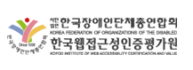
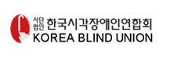

[< 뒤로가기](../README.md)

# Web Accessibility (웹 접근성)

### 웹 접근성이 뭐지?
> 웹이란 '장애에 구애 없이 모든 사람들이 손쉽게 정보를 공유할 수 있는 공간'  
> 웹 콘텐츠를 제작할 때에는 장애에 구애됨이 없이 누구나 접근할 수 있도록 제작 
>
> --웹의 창시자(팀 버너스 리)--

 

#### 마음가짐
접근성이 왜 필요한지 잘 모르는 사람들이 아직도 많습니다.  
접근성 사업을 하고 인증마크를 획득하고있는 지금 이 시점에도, 마크를 따기위해 접근성을 하는 것인지 모든 사람의 편의를 위해서 마크를 따는 것 인지에 대해서 생각해 봐야 할 것 같습니다.  
접근성 마크를 위한 접근성이 아닌 사용성과 편의성을 생각한 접근성 사업이 되었으면 좋겠습니다.  

 

### 인증마크는 누가 주는거야?
> 2014년 1월 24일 기존 한국정보화진흥원에서 미래창조과학부로 품질인증기관이 바뀝니다.  
> 미래창조과학부가 아래 3개의 기관을 선정하였고, 아래 기관만이 접근성 마크를 줄 수 있습니다.
> (원래 4곳이었지만 1곳이 포기함)  

  

 

### 접근성 마크 어떻게 따는걸까?

#### 기준 & 절차
미래창조과학부 산하 3개의 인증기관이 선정되면서 절차와 심사기준 또한 3곳 모두 비슷한 것으로 알고있습니다.  
(이후 설명되는 내용은 절대적인 것은 아니고, 개인적인 경험으로 적은 것 입니다.)

#### [접근성 신청 절차 보러가기](procedure.md)  

   